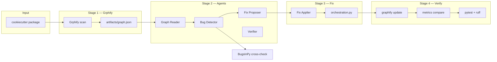
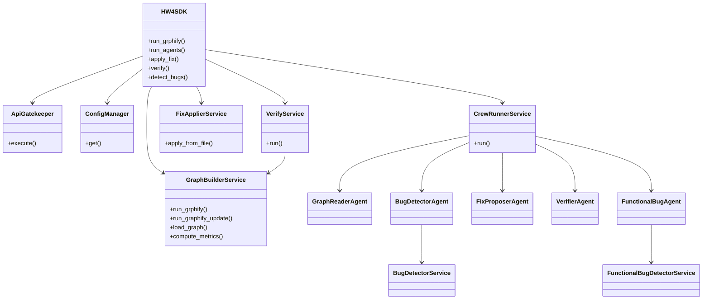
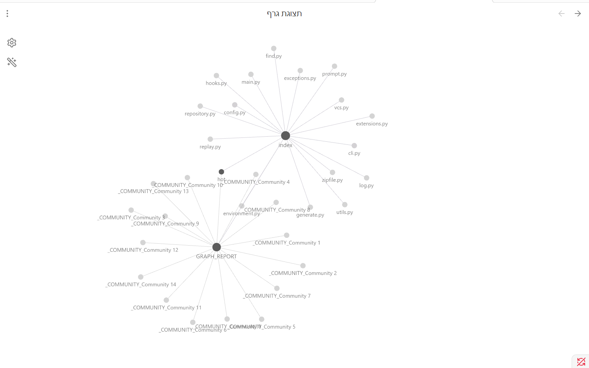
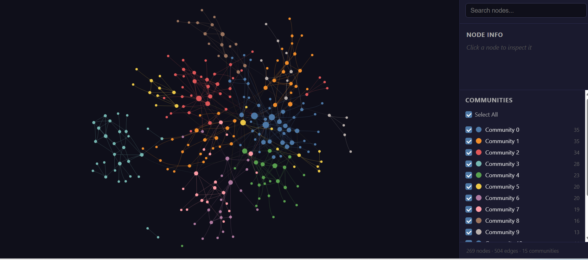
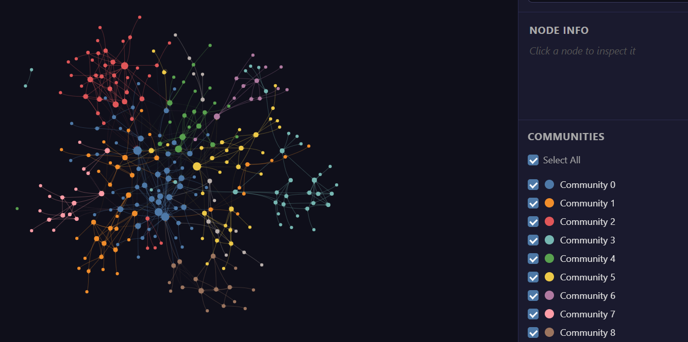
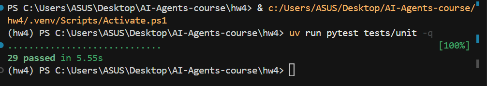

# EX04 — Reverse Engineering with Grphify + CrewAI

## 1. Goal

This project analyzes a real Python codebase using **Grphify** (a graph builder) and **CrewAI** (multi-agent AI). The goal is to:

1. Build a code graph of the target project
2. Use agents to read the graph first, then the code — not the whole repo at once
3. Find architectural problems (overloaded hubs, weak structure)
4. Propose and apply one fix
5. Verify the fix with new graph metrics and unit tests

The main idea: **the graph tells the agents where to look**, which saves tokens and points to important files.

---

## 2. Target project — why cookiecutter?

We work on **[cookiecutter](https://github.com/cookiecutter/cookiecutter)** — the Python tool that generates projects from templates.

**Why we chose it:**

| Reason | Detail |
|--------|--------|
| Small enough | Only **18 Python files** in the package (`cookiecutter/cookiecutter/`) |
| Clear graph | ~269 nodes, readable communities, visible hot spots |
| Real hub bug | `cookiecutter()` in `main.py` is a coordination hub (degree 16) |
| BugsInPy overlap | The same repo exists in [BugsInPy cookiecutter bugs](https://github.com/soarsmu/BugsInPy/tree/master/projects/cookiecutter/bugs) — we can check if our graph finds the same files |

We scan **the package only**, not the full cookiecutter repository. That keeps the graph focused and the fix scoped.

---

## 3. Project structure

```
hw4/
├── src/hw4/           # Our code: SDK, agents, services
├── tests/unit/        # Unit tests (29 tests, ~85% coverage)
├── config/            # setup.json, rate_limits.json
├── artifacts/         # Graph outputs (graph.json, graph.html, reports)
├── results/           # Agent output, metrics, fix patch
├── reports/           # verification.md
├── obsidian/          # Obsidian vault (graph navigation)
├── assets/            # Screenshots for submission
├── docs/              # PRD, plans, TODO
└── data/cookiecutter/ # Cloned target repo (local only, not in git)
```

**Important paths:**

| Path | What it is |
|------|------------|
| `artifacts/graph.json` | Graph before the fix |
| `artifacts/graph_after.json` | Graph after the fix |
| `artifacts/graphify-out/` | Grphify working folder (gitignored) |
| `results/fix_diff.patch` | The code change we applied |
| `results/functional_bugs.json` | Cross-check with BugsInPy bugs |

---

## 4. How to install and run

### Install

```bash
cd hw4
uv sync
cp .env-example .env
# Edit .env and add your OPENAI_API_KEY
```

Clone cookiecutter locally (one time):

```bash
git clone https://github.com/cookiecutter/cookiecutter.git data/cookiecutter
```

### Run the pipeline (Python SDK)

```python
from hw4.sdk.sdk import HW4SDK

sdk = HW4SDK()

sdk.run_grphify()      # Step 1: build graph → artifacts/
sdk.run_agents()       # Step 2: agents find bugs → results/
sdk.apply_fix()        # Step 3: apply hub fix on main.py
sdk.verify()           # Step 4: re-scan + compare metrics + run tests
```

### Run tests and linter

```bash
uv run pytest tests/unit -q
uv run ruff check src tests
```

---

## 5. How the project works (algorithm)

The pipeline has **5 clear steps**:

```
Grphify scan  →  Graph JSON  →  Agents  →  Fix  →  Verify
```

### Step 1 — Grphify (build the graph)

Grphify reads Python files and builds a graph:

- **Nodes** = functions, classes, files, doc strings
- **Edges** = calls, imports, inherits, uses, etc.

Output goes to `artifacts/` (graph.json, graph.html, index.md, hot.md).

### Step 2 — Graph-first agents (CrewAI)

Four agents run in order:

1. **Graph Reader** — reads `graph.json` + `hot.md`, builds a short summary (not the full repo)
2. **Bug Detector** — finds **HUB** nodes where degree > 10 (too many connections)
3. **Fix Proposer** — picks one bug and suggests a structural fix
4. **Verifier** — checks if the fix should improve the graph

**Why graph-first?**

| Approach | Estimated tokens |
|----------|------------------|
| Naive (send all code) | ~23,537 |
| Graph-guided (our way) | ~645 |
| **Savings** | **~97%** |

The agents only open hot files from the graph — not every file in the repo.

### Step 3 — Bug detection rules

**Architectural bugs** (what we fix):

- **HUB** — one node connects to too many others (degree > threshold)
- Found in: `main.py`, `prompt.py`, `exceptions.py`

**Functional cross-check** (BugsInPy validation):

- We compare graph-hot files with known bugs in the [BugsInPy cookiecutter folder](https://github.com/soarsmu/BugsInPy/tree/master/projects/cookiecutter/bugs)
- This does **not** mean we fix those bugs — it proves the graph points to real problem areas

### Step 4 — Apply fix

We chose the **HUB on `cookiecutter()` in `main.py`**:

- **Problem:** one function does too much — hard to change, high coupling
- **Fix:** move logic to `orchestration.py`, keep `main.py` as a thin entry point
- **Patch:** `results/fix_diff.patch`

### Step 5 — Verify

After the fix:

1. Re-run Grphify on the changed package (`graphify update`)
2. Compare before/after metrics
3. Run pytest and ruff

All results go to `reports/verification.md` and `results/metrics_comparison.json`.

### Block diagram (pipeline)



### OOP schema (hw4 code)



---

## 6. Results

### 6.1 Graph metrics (before vs after)

| Metric | Before | After |
|--------|--------|-------|
| Nodes | 269 | 283 |
| Edges | 504 | 529 |
| Communities | 15 | 16 |
| `cookiecutter()` hub degree | 16 | 20 |
| Orchestration hub sum | — | 43 |

**How to read this:** the entry function still coordinates the pipeline, so its degree can stay high. The fix **splits the work** into `orchestration.py` — new smaller nodes instead of one big block. The verify step marks this as **improved: true**.

### 6.2 Top hubs found (before fix)

| Node | File | Degree |
|------|------|--------|
| `UndefinedVariableInTemplate` | exceptions.py | 21 |
| `CookiecutterException` | exceptions.py | 20 |
| `exceptions.py` | exceptions.py | 19 |
| **`cookiecutter()`** | **main.py** | **16** ← we fixed this |
| `prompt.py` | prompt.py | 16 |

Full list: `results/bugs.json`

### 6.3 Match with BugsInPy bugs folder

Our graph-hot files match **all 4** known BugsInPy cookiecutter bugs:

| BugsInPy # | File | Graph hub match | Status |
|------------|------|-----------------|--------|
| 1 | `generate.py` | yes | CONFIRMED_HISTORICAL |
| 2 | `hooks.py` | yes | CONFIRMED_HISTORICAL |
| 3 | `prompt.py` | yes | CONFIRMED_HISTORICAL |
| 4 | `exceptions.py` | yes | CONFIRMED_HISTORICAL |

Full details: `results/functional_bugs.json`

This shows: **agents guided by the graph reach the same files as the BugsInPy benchmark** — strong proof the approach works.

| What we did | What we did not do |
|-------------|-------------------|
| Fixed the **architectural HUB** in `main.py` | Did not patch the 4 functional BugsInPy bugs (out of scope) |
| Validated overlap with BugsInPy | Used historical commits to confirm the match |

---

## 7. Screenshots

| Screenshot | Shows |
|------------|-------|
| Obsidian graph (before) | Before-fix graph in Obsidian |
| HTML graph (before) | Interactive graph in browser |
| Graph after fix | Graph after hub refactor |
| Tests passing | 29 unit tests |









---

## 8. Proof that everything works

| Check | Result | Where to see it |
|-------|--------|-----------------|
| Unit tests | **29 passed** | `assets/tests_pass.png` |
| Test coverage | **~86%** | `reports/verification.md` |
| Ruff linter | **0 errors** | `reports/verification.md` |
| Graph re-built after fix | yes | `artifacts/graph_after.json` |
| Metrics improved | yes (`improved: true`) | `results/metrics_comparison.json` |
| Fix applied | yes | `results/fix_diff.patch` |
| Agents found bugs | yes | `results/bugs.json` |
| BugsInPy file match | **4/4** | `results/functional_bugs.json` |
| Token savings | **~97%** | `results/token_stats.json` |

---

## 9. Summary

We built a full pipeline for **EX04**:

1. Scanned **cookiecutter** with Grphify and got a clear architecture graph
2. Ran **graph-guided CrewAI agents** that use ~97% fewer tokens than reading all code
3. Found **architectural hub bugs**, including `cookiecutter()` in `main.py`
4. Showed our hot files **match all 4 BugsInPy cookiecutter bugs** — the graph finds real problem areas
5. **Fixed** the main hub by extracting logic to `orchestration.py`
6. **Verified** with new graph metrics, passing tests, and clean lint

The project meets the assignment goals: graph analysis, multi-agent detection, one focused fix, and proof it works.

---

## 10. Config and credits

**Config:** `config/setup.json` (hub threshold = 10, top 20 nodes)  
**Secrets:** `.env` (API keys only — never committed)

**Tools:** [Grphify](https://pypi.org/project/graphifyy/), [CrewAI](https://crewai.com/), [cookiecutter](https://github.com/cookiecutter/cookiecutter), [BugsInPy](https://github.com/soarsmu/BugsInPy)

**More detail:** `reports/architecture_analysis.md`, `docs/PROMPT_LOG.md`

**Course:** EX04 — Reverse Engineering with Grphify + CrewAI (Dr. Yoram Segal)

**Version:** 1.00
