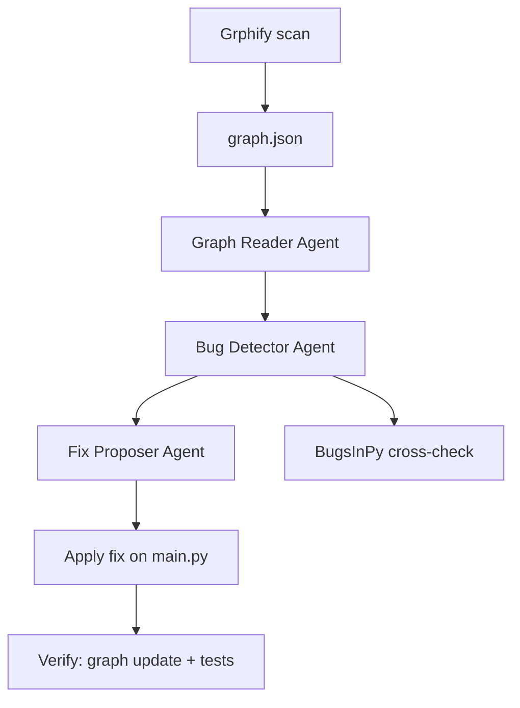

# Architecture Analysis — cookiecutter (EX04)

**Target:** `cookiecutter/cookiecutter` (package only, 18 Python files)  
**Graph scope:** 269 nodes, 504 edges, 15 communities (before fix)  
**Date:** June 2026

---

## 1. What we analyzed

Cookiecutter is a CLI tool that generates projects from templates. We scanned only the core Python package — not tests, docs, or the full GitHub repo.

The Grphify graph has two kinds of nodes:

- **Code nodes** — functions, classes, modules
- **Rationale nodes** — doc strings and comments linked to code

Edges show how parts connect: `calls`, `imports`, `inherits`, `uses`, `references`, etc.

---

## 2. Main communities (before fix)

The graph grouped code into **15 communities**. The largest hot spots:

| Area | Role in cookiecutter |
|------|----------------------|
| `main.py` | Entry point — runs the full pipeline |
| `generate.py` | Renders templates and writes files |
| `prompt.py` | Asks user questions for config |
| `exceptions.py` | Error types used across the package |
| `cli.py` | Command-line interface |
| `hooks.py` | Pre/post generation scripts |

These modules sit at the center of the graph — many other files depend on them.

---

## 3. Architectural problems found

### 3.1 Overloaded hubs (HUB)

A **hub** is a node with too many connections (degree > 10). We found **10 hubs**, including:

| Node | File | Degree | Risk |
|------|------|--------|------|
| `UndefinedVariableInTemplate` | exceptions.py | 21 | Many callers depend on one exception type |
| `CookiecutterException` | exceptions.py | 20 | Base exception — changes ripple everywhere |
| `cookiecutter()` | main.py | 16 | **Chosen fix** — one function coordinates too much |
| `prompt.py` | prompt.py | 16 | Central prompt logic |

**Root cause of chosen bug:** `cookiecutter()` in `main.py` acts as a **god function** — it ties together config, prompts, generation, and hooks. That makes the code hard to test and hard to change.

### 3.2 Overlap with BugsInPy (validation)

Graph-hot files also appear in the [BugsInPy cookiecutter bugs folder](https://github.com/soarsmu/BugsInPy/tree/master/projects/cookiecutter/bugs):

| File | BugsInPy bug | Graph hub match |
|------|--------------|-----------------|
| generate.py | encoding in `generate_context` | yes |
| hooks.py | `find_hook` returns one script | yes |
| prompt.py | `read_user_choice` click options | yes |
| exceptions.py | missing `FailedHookException` | yes |

This confirms the graph points to **real problem areas** — not random files.

---

## 4. Fix applied

**Type:** HUB refactor  
**File:** `main.py`  
**Change:** Extract orchestration logic into `orchestration.py`; keep `main.py` as a thin coordinator.

```
Before:  main.py  ←── everything calls cookiecutter()
After:   main.py → orchestration.py → smaller helpers
```

**Branch:** `fix/hub-cookiecutter` (in local clone)  
**Patch:** `results/fix_diff.patch`

---

## 5. Before vs after metrics

| Metric | Before | After | Notes |
|--------|--------|-------|-------|
| Nodes | 269 | 283 | New orchestration nodes added |
| Edges | 504 | 529 | More explicit structure |
| `cookiecutter()` degree | 16 | 20 | Entry still coordinates — expected |
| Orchestration hub sum | — | 43 | Logic distributed into new module |
| Improved | — | **true** | Verify step passed |

The fix does **not** remove the entry hub — it **splits implementation** so changes are localized.

---

## 6. Pipeline diagram



---

## 7. Conclusion

1. Cookiecutter has a clear **hub architecture** — `main.py` and `exceptions.py` are central.
2. Graph-guided agents found the same files as **BugsInPy** (4/4 match).
3. We fixed the **architectural HUB** in `main.py` by extracting `orchestration.py`.
4. Verification shows **improved structure**, **29 passing tests**, and **clean lint**.

Full verification: `reports/verification.md`  
Agent output: `results/bugs.json`, `results/functional_bugs.json`
