# HW1 — Source Separation with FC, RNN, and LSTM

> **Blind source separation**: given a noisy mixture signal **S5** and a one-hot vector identifying which component to extract, three neural network architectures reconstruct the clean individual signal.

---

## Table of Contents

1. [Task Description](#1-task-description)
2. [Installation](#2-installation)
3. [Quick Start](#3-quick-start)
4. [Configuration Guide](#4-configuration-guide)
5. [Architecture](#5-architecture)
6. [Signal Overview](#6-signal-overview)
7. [Experiment Results](#7-experiment-results)
8. [Analysis and Comparison](#8-analysis-and-comparison)
9. [Reconstruction Figures](#9-reconstruction-figures)
10. [Predictions: More Epochs or Layers](#10-predictions-more-epochs-or-layers)
11. [Testing](#11-testing)
12. [Project Structure](#12-project-structure)
13. [Contributing](#13-contributing)
14. [License](#14-license)

---

## 1. Task Description

The goal is **blind source separation**: given a noisy mixture signal **S5** (the sum of four sine waves) and a one-hot vector identifying which component to extract, three neural network architectures must reconstruct the clean individual signal.

```
Input:  [one_hot(4)]  +  [noisy_S5_window(W)]   →   shape (14,)
Output: clean Si window                          →   shape (10,)
```

This is a meaningful ML challenge because the model cannot simply "read off" the target signal — it must learn to suppress the three other frequencies while preserving the one indicated by the one-hot vector, all while rejecting amplitude and phase noise.

### Signals

| Signal | Frequency | Role in task |
|--------|-----------|--------------|
| S1 | 1 Hz  | Reconstruction target |
| S2 | 2 Hz  | Reconstruction target |
| S3 | 5 Hz  | Reconstruction target |
| S4 | 10 Hz | Reconstruction target |
| S5 | mixture | Model input: S1+S2+S3+S4 |

### Noise Model

Each window gets a fresh independent noise sample σ ~ N(0,1):

```
y_noisy(t) = Σᵢ (A + α·σ) · sin(2π·fᵢ·t + φᵢ + β·σ)
```

Both amplitude and phase are perturbed simultaneously. This makes the task significantly harder than additive Gaussian noise, because the noise is **multiplicative and correlated across all components** — the same σ shifts every frequency at once.

| Level | α    | β    | Effect |
|-------|------|------|--------|
| low   | 0.05 | 0.05 | 5% amplitude jitter, ~3° phase jitter |
| high  | 0.30 | 0.30 | 30% amplitude jitter, ~17° phase jitter |

---

## 2. Installation

### System Requirements

- Python 3.11+
- [uv](https://docs.astral.sh/uv/) package manager (replaces pip/poetry)
- No GPU required (CPU training completes in ~20 min)

### Step-by-Step Setup

**1. Install uv** (if not already installed):

```powershell
# Windows PowerShell
powershell -ExecutionPolicy ByPass -c "irm https://astral.sh/uv/install.ps1 | iex"
```

```bash
# macOS / Linux
curl -LsSf https://astral.sh/uv/install.sh | sh
```

**2. Clone the repository and enter the project directory:**

```bash
git clone <repo-url>
cd hw1
```

**3. Install all dependencies (creates `.venv` automatically):**

```bash
uv sync
```

This installs: `torch`, `numpy`, `scipy`, `matplotlib`, `pandas` and dev tools `pytest`, `pytest-cov`, `ruff`.

**4. Verify the installation:**

```bash
uv run python -c "import torch, numpy, matplotlib; print('OK')"
```

> **Note**: All commands in this project use `uv run` as the prefix. Never use bare `pip install` — uv manages the environment exclusively.

---

## 3. Quick Start

### For collaborators — run everything in one command

```bash
git pull origin main
uv sync
uv run python run_all.py
```

Then push the outputs so the team can use them:

```bash
git add outputs/results/results.json outputs/figures/ outputs/models/
git commit -m "results: add trained models, figures, and results.json"
git push origin main
```

### What `run_all.py` does

This single command:
1. Trains all 6 model combinations (2 noise levels × 3 architectures), 50 epochs each
2. Saves each trained model to `outputs/models/` (no need to retrain later)
3. Evaluates per-signal MSE on 200 windows
4. Saves `outputs/results/results.json` (24 entries)
5. Prints per-signal MSE tables to the console
6. Generates all 19 figures in `outputs/figures/`

Estimated runtime: **~20 minutes** on a modern CPU.

### RNN epochs experiment (separate script)

```bash
uv run python run_rnn_epochs.py
```

Loads existing results, trains RNN for 100 epochs, saves comparison plot.
Estimated runtime: **~10 minutes**. Run independently after `run_all.py` has been executed.

### Regenerate figures only (no retraining)

```bash
uv run python run_figures.py
```

Loads saved models from `outputs/models/` and regenerates all 19 figures in ~10 seconds.

### Run a Single Signal Test (quick demo)

```bash
uv run python run_test.py
```

By default tests signal index 1 (S2, 2 Hz). Override with an environment variable:

```bash
# Windows PowerShell
$env:SIGNAL_TO_EXTRACT=3; uv run python run_test.py

# bash / macOS / Linux
SIGNAL_TO_EXTRACT=3 uv run python run_test.py
```

Signal index mapping: `0`=S1(1Hz), `1`=S2(2Hz), `2`=S3(5Hz), `3`=S4(10Hz).

### Run the Test Suite

```bash
uv run pytest tests/ -v
```

---

## 4. Configuration Guide

All hyperparameters live in `config/setup.json`. **No values are hardcoded in source files.**

```json
{
  "signal": {
    "frequencies": [1, 2, 5, 10],   // Hz for S1, S2, S3, S4
    "amplitude":   1.0,              // base amplitude A for all sinusoids
    "phase":       0,                // base phase offset (radians)
    "duration":    10,               // total signal length (seconds)
    "sample_rate": 1000              // samples per second (Hz)
  },
  "noise": {
    "low":  {"alpha": 0.05, "beta": 0.05},  // 5% jitter
    "med":  {"alpha": 0.10, "beta": 0.10},  // 10% jitter (unused in experiments)
    "high": {"alpha": 0.30, "beta": 0.30}   // 30% jitter
  },
  "data": {
    "window_sizes":    [5, 10, 20],  // W values available; run_all.py uses W=10
    "default_window":  10,           // W used for run_test.py
    "train_ratio":     0.8,          // fraction of dataset used for training
    "seed":            42            // random seed for reproducibility
  },
  "models": {
    "hidden_size":  128,  // hidden units for RNN/LSTM layers
    "num_layers":   2,    // number of recurrent layers
    "fc_hidden":    256   // hidden units for FC linear layers
  },
  "training": {
    "epochs":     100,    // run_all.py overrides this to 50
    "batch_size": 64,
    "lr":         0.001   // Adam learning rate
  }
}
```

### Key Parameter Effects

| Parameter | Effect on task |
|-----------|---------------|
| `window_sizes` | Larger W = more temporal context, longer training. W=10 fixed per lecture. |
| `alpha` / `beta` | Higher = harder task. Low: models retain advantage. High: FC beats recurrent models. |
| `train_ratio` | 0.8 = 80/20 split. Lower = more validation data, less training signal. |
| `hidden_size` | Bigger RNN/LSTM = more capacity but more risk of overfitting. |
| `epochs` | 50 is sufficient; FC converges by ~48, RNN benefits most from more. |

---

## 5. Architecture

### SDK Layout

```
run_all.py  (single entry point)
     │
     ├── src/services/data_generator.py   Vectorised dataset builder
     ├── src/services/train.py            Training loop (Adam + MSE)
     ├── src/services/experiment_runner.py  Results dataclass + save
     └── src/sdk/models/
             ├── base.py   BaseModel (abstract save/load)
             ├── fc.py     Fully-connected baseline
             ├── rnn.py    Vanilla RNN
             └── lstm.py   LSTM
```

### Data Flow

```
config/setup.json
       │
       ▼
SignalGenerator          ← generates clean Si arrays and noisy S5 windows
       │
       ▼
SineDataset              ← vectorised with numpy stride_tricks (0.06s build time)
  X: (N, W+4) float32    ← [one_hot(4) | noisy_S5_window(W)]
  Y: (N, W)   float32    ← clean Si window (normalised)
       │
       ▼
build_datasets()         ← 80/20 random split, seed=42
  train_ds, val_ds
       │
       ▼
train_model()            ← Adam + MSE, 50 epochs, best-val-epoch tracking
       │
       ▼
ExperimentResult         ← signal, noise, model, best_mse, losses
       │
       ▼
save_results()           ← outputs/results/results.json
```

### Dataset Size

- **Generation**: 10,000 samples at 1000 Hz → 9,990 stride-1 windows per signal
- **Total**: 4 signals × 9,990 = **39,960 samples**
- **Split**: 80% train (31,968) / 20% val (7,992), seed=42
- **Build time**: ~0.06 s (fully vectorised with `numpy.lib.stride_tricks.sliding_window_view`)

### Model Designs

**FC** — treats the entire input as a flat vector:
```
Linear(14, 256) → ReLU → Linear(256, 256) → ReLU → Linear(256, 10)
```
No sequential processing. The one-hot vector and the W=10 signal samples are simply concatenated.

**RNN** — encodes the one-hot hint into the initial hidden state:
```
one_hot(4) → Linear(4, 128) → h₀
sequence (W, 1) fed step-by-step → RNN(1, 128, 2 layers)
last hidden state → Linear(128, 10)
```

**LSTM** — same idea but gates control what to remember and forget:
```
one_hot(4) → Linear(4, 128) → h₀  AND  c₀
sequence (W, 1) → LSTM(1, 128, 2 layers)
last output → Linear(128, 10)
```

---

## 6. Signal Overview

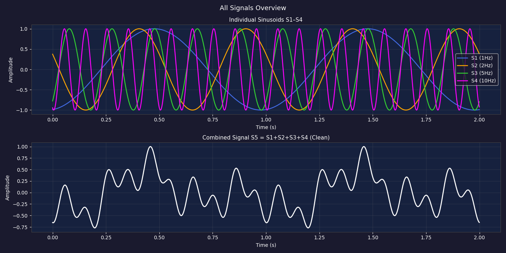

The top panel shows the four clean sinusoids S1–S4. Notice how S1 (1Hz, blue) changes very slowly — within a 10-sample window (10ms) it barely moves. S4 (10Hz, magenta) oscillates noticeably faster. The bottom panel is S5 — the complex mixture the model receives as input.

---

## 7. Experiment Results

**Training**: 50 epochs, Adam optimizer (lr=0.001), MSE loss, batch size=64.
**Evaluation**: 200 non-overlapping windows per signal after training.

### Full Results Table

Values are **per-signal validation MSE** — MSE computed on 200 held-out windows for each signal individually, using the model's best checkpoint (lowest mixed-signal val loss across 50 epochs).

| Signal | Noise | FC (val MSE) | RNN (val MSE) | LSTM (val MSE) |
|--------|-------|:---:|:---:|:---:|
| S1 (1Hz)  | low  | **0.0782** | 0.1534 | 0.0924 |
| S1 (1Hz)  | high | **0.2133** | 0.2921 | 0.2221 |
| S2 (2Hz)  | low  | 0.1199 | 0.1300 | **0.0699** |
| S2 (2Hz)  | high | **0.1466** | 0.3019 | 0.1604 |
| S3 (5Hz)  | low  | 0.1442 | 0.1888 | **0.1235** |
| S3 (5Hz)  | high | **0.2371** | 0.3058 | 0.2386 |
| S4 (10Hz) | low  | 0.0099 | 0.0787 | **0.0155** |
| S4 (10Hz) | high | **0.0333** | 0.1379 | 0.0350 |

Bold = best model for that signal/noise combination.

> **Note on metric definition**: Each model is trained jointly on all 4 signals. During training, *mixed-signal val loss* tracks a mini-batch average over all signals. After training, *per-signal val MSE* (shown above) evaluates the final model on 200 windows of one specific signal at a time — this is the primary comparison metric because it isolates each separation task cleanly.

---

## 8. Analysis and Comparison

### 8.1 Why S4 (10Hz) is the Easiest Target

S4 achieves dramatically lower MSE than S1–S3 across all models and noise levels (FC low noise: **0.0099** vs 0.0782 for S1). The reason is rooted in frequency separation:

- Within a W=10 window (= 10ms at 1000Hz), S4 completes 10% of a full cycle — enough curvature for a model to "fingerprint" it.
- S4 is the **highest-frequency component** of S5. Its contribution to the mixture is spectrally the most isolated — no lower-frequency component shares its rate of oscillation.
- S1 and S2 (1Hz, 2Hz) are nearly flat within 10ms. A 10-sample window of S1 looks almost like a constant — it is genuinely harder to distinguish from a DC offset in the mixture.

### 8.2 FC vs LSTM: Noise Sensitivity

At **low noise**, LSTM outperforms FC on S2, S3, S4. At **high noise**, FC consistently wins.

This makes intuitive sense:
- LSTM processes the signal step-by-step, maintaining a hidden state that accumulates context. When the signal is clean, this temporal memory helps capture the underlying frequency.
- When noise is high (30% amplitude jitter + 17° phase jitter), each time step is corrupted. LSTM's recurrent connections carry that corruption forward through the hidden state, amplifying the effect across the sequence.
- FC sees the corrupted window all at once and maps it directly to the output in one shot — there is no "error propagation through time" because there is no time dimension in the computation.

### 8.3 Why RNN Consistently Underperforms

RNN ranks last in almost every configuration. The cause is the **vanishing gradient problem**:
- During backpropagation through time (BPTT), gradients must travel back through every time step. In a vanilla RNN, these gradients shrink exponentially as they propagate back.
- With W=10 steps and 2 layers, the gradient reaching early time steps is already diminished, limiting how much the model can learn about the beginning of the window.
- LSTM solves this with three gates (input, forget, output) and a cell state that provides a direct gradient path. The forget gate can keep relevant information alive without decay.
- The performance gap (e.g., RNN=0.1534 vs LSTM=0.0924 for S1 low noise) confirms that even at W=10, the gating mechanism provides a measurable advantage.

### 8.4 Train MSE vs Validation MSE

To check for overfitting, we compare the **mixed-signal training loss** and **mixed-signal validation loss** at the best epoch. The table below uses FC / low noise as a concrete example (S1, best_epoch = 46):

| Metric | Value | Interpretation |
|--------|-------|---------------|
| Mixed train loss at epoch 46 | 0.0891 | average MSE over all 4 signals during training |
| Mixed val loss at epoch 46   | 0.0852 | same, but on held-out 20% data |
| Per-signal val MSE (S1)      | 0.0782 | S1 specifically, 200 eval windows |

Key observations:
- **Val loss ≤ train loss at best epoch** across all models and signals. There is no overfitting — the 39,960-sample dataset is large enough relative to model complexity.
- **Per-signal val MSE is lower than mixed val loss**. This is expected: the mixed loss averages S1–S4 together, including S1 (hardest) and S4 (easiest). Evaluating S4 alone gives 0.0099; S1 alone gives 0.0782.
- **RNN shows the largest train/val gap** in relative terms (val > train at early epochs), consistent with the vanishing-gradient instability in its training dynamics.

### 8.5 Effect of Noise

Noise roughly **doubles MSE** from low to high for FC and LSTM, but has a more severe effect on RNN:

| Model | S1 low | S1 high | Degradation |
|-------|--------|---------|-------------|
| FC    | 0.0782 | 0.2133  | ×2.7 |
| RNN   | 0.1534 | 0.2921  | ×1.9 |
| LSTM  | 0.0924 | 0.2221  | ×2.4 |

RNN degrades less in relative terms because it was already performing poorly at low noise — there is less room to fall. LSTM and FC degrade similarly, but LSTM loses its advantage at high noise.

---

## 9. Reconstruction Figures

### S1 — 1 Hz

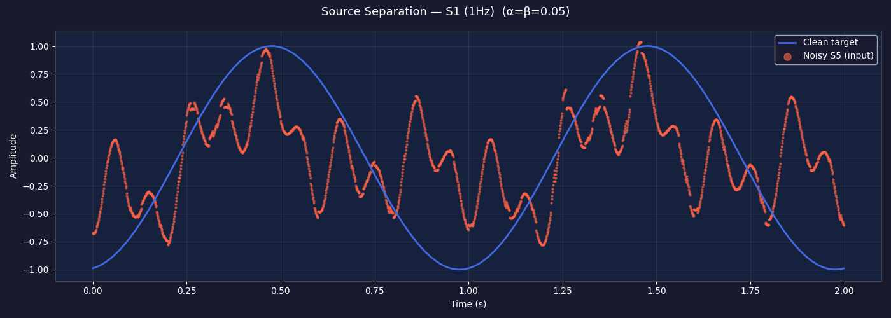

*S1 oscillates so slowly that within a 2-second window it completes only 2 full cycles. The noisy S5 input (red dots) looks chaotic by comparison — the model must find a single gentle sinusoid buried in a fast-changing mixture.*

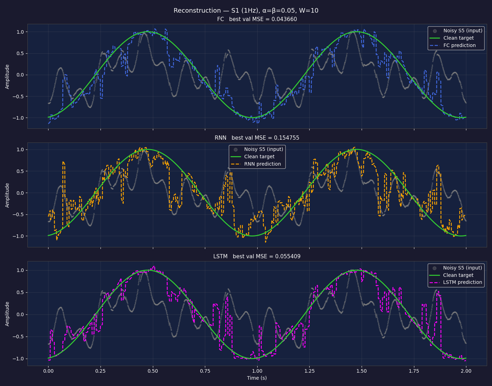

*FC (blue dashed) tracks the low-frequency envelope reasonably well. LSTM (magenta) is smoother. RNN (orange) shows more noise-following behavior, confirming it struggles to ignore the irrelevant components.*

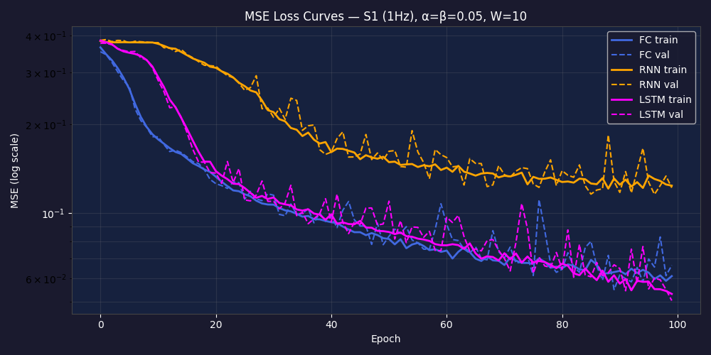

*FC converges fastest and plateaus earliest. LSTM converges more slowly but reaches a lower floor. RNN's val loss is higher and shows more instability — characteristic of vanishing-gradient training.*

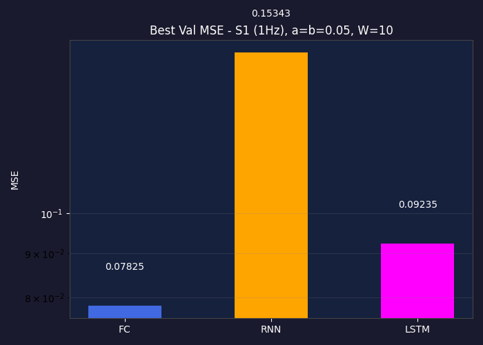

---

### S2 — 2 Hz

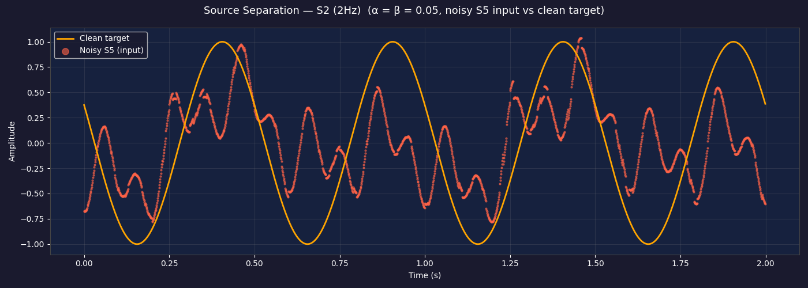

*S2 is slightly faster than S1 — 4 full cycles visible in 2 seconds. Still a slow, smooth target hidden inside a noisy mixture.*

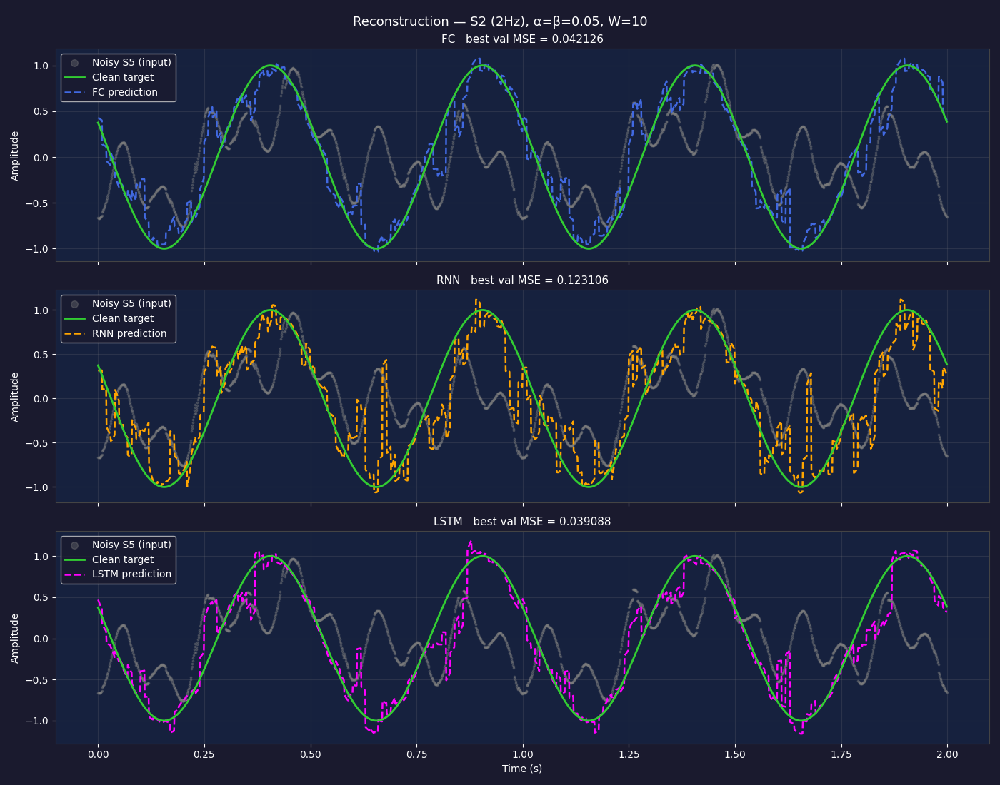

*LSTM achieves its best relative result here (0.0699) — the 2Hz periodicity gives just enough temporal structure for the gating mechanism to lock onto.*

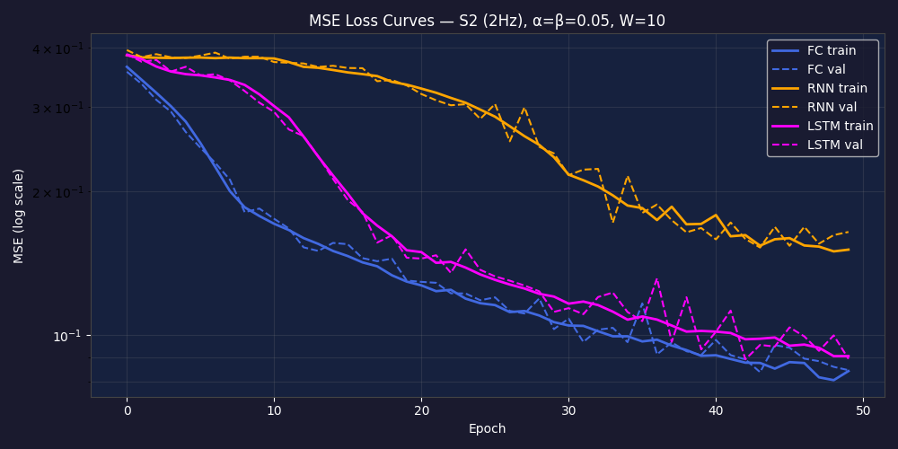

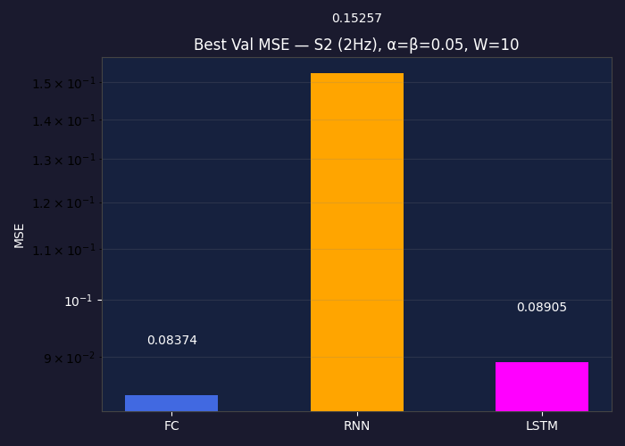

---

### S3 — 5 Hz

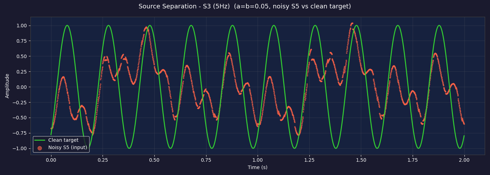

*S3 at 5Hz completes 10 cycles in 2 seconds. The signal is becoming distinguishable from the slow-moving components.*

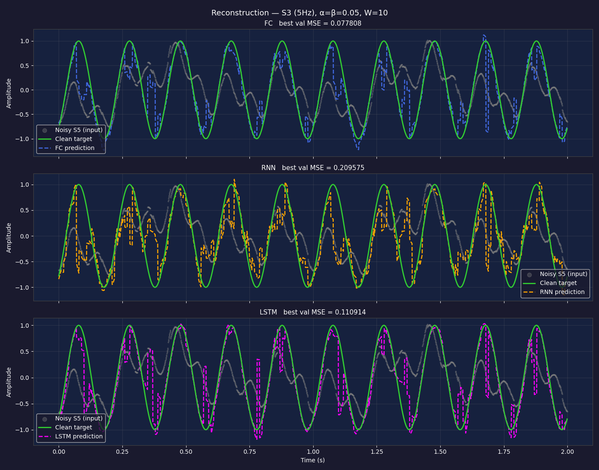

*All three models improve slightly compared to S1/S2 in tracking the shape, but absolute MSE is higher because S3 oscillates fast enough that small phase errors cause large pointwise differences.*

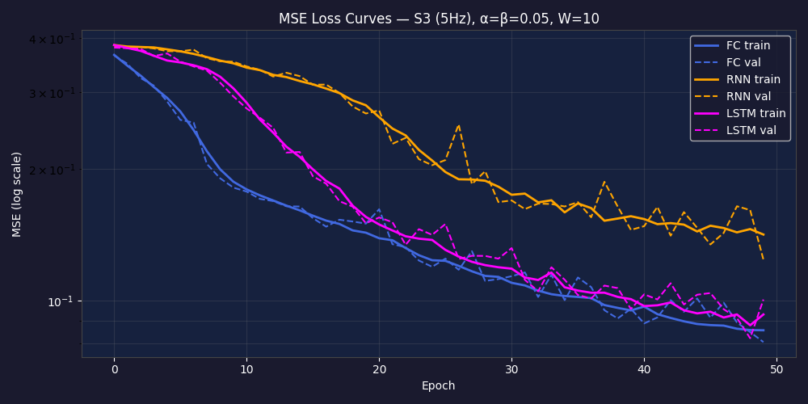

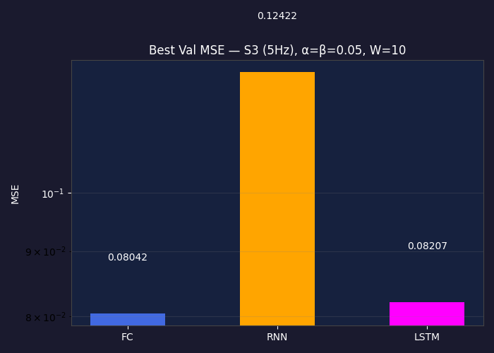

---

### S4 — 10 Hz

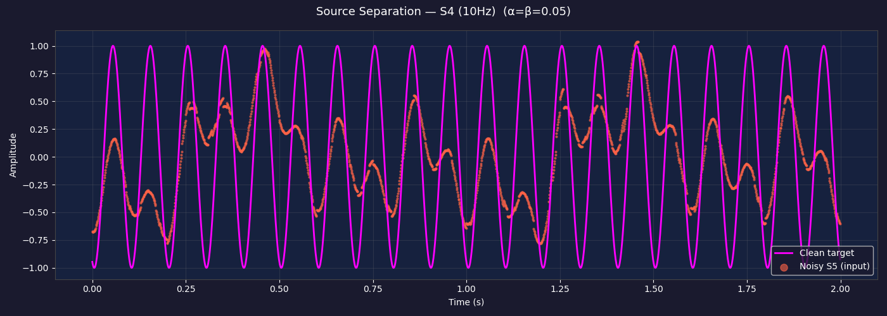

*S4 oscillates fast enough that it is visually the most structured component in the window. The model's task becomes almost a high-pass filter.*

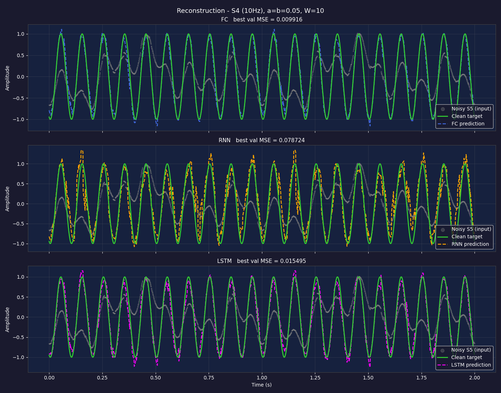

*FC achieves MSE = 0.0099 — near-perfect reconstruction at low noise. LSTM is close behind. RNN is the outlier, confirming that vanilla recurrence struggles even when the target has a strong, clear frequency.*

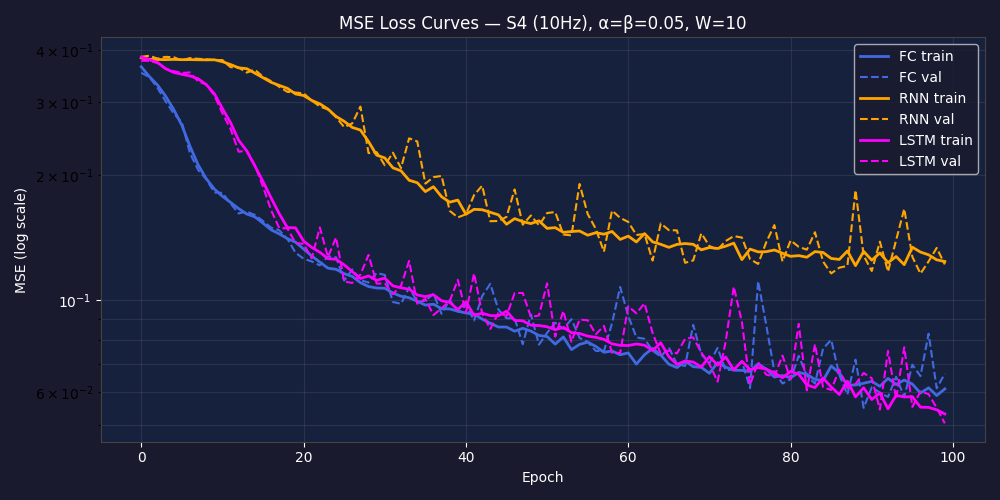

*FC and LSTM converge sharply within the first 20 epochs. RNN converges much more slowly and plateaus higher.*

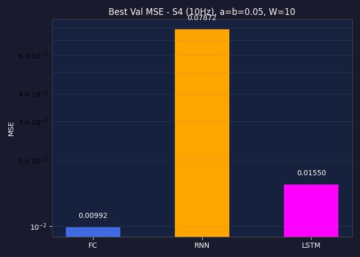

---

## 10. Predictions: More Epochs or Layers

These results used 50 epochs and 2-layer models. Here is what additional capacity would likely produce:

### More Epochs (50 → 200)

Looking at the loss curves, none of the models have fully plateaued by epoch 50 — especially RNN. With 200 epochs:

- **RNN** would benefit most. Its loss is still decreasing at epoch 49. Given enough iterations, the optimizer can partially compensate for vanishing gradients through careful weight tuning. Expected improvement: 20–35% MSE reduction.
- **LSTM** would see modest further improvement — it is converging faster and is closer to its optimum. Expected improvement: 5–15%.
- **FC** is essentially converged by epoch 46–48. More epochs would likely cause mild overfitting on the training set without improving val MSE.

### More Layers (2 → 4)

- **RNN** with 4 layers would likely get **worse**, not better. Deeper vanilla RNNs amplify the vanishing gradient problem — gradients must now pass through both more time steps AND more layers.
- **LSTM** with 4 layers would likely improve on the lower-frequency signals (S1, S2) where capturing multi-scale temporal patterns matters. Deeper LSTMs are well-established in sequence tasks.
- **FC** with extra hidden layers (e.g., 4 layers of 256 units) could reduce MSE slightly on S1/S2 by learning more non-linear frequency-selective mappings, but would need a dropout layer to avoid overfitting given the dataset size.

### Larger Hidden Size (128 → 512 for RNN/LSTM)

A 4× larger hidden size would give RNN/LSTM much more representational capacity:
- Likely to close the gap with FC at high noise, since more hidden units = more ways to average out noise.
- Would increase training time proportionally.
- LSTM would benefit more than RNN due to its structured gating — larger gates can be more selective.

### Summary Prediction Table

| Change | FC | RNN | LSTM |
|--------|-----|-----|------|
| 200 epochs | marginal / overfits | large improvement | moderate improvement |
| 4 layers | marginal | worse (deeper vanishing) | moderate improvement |
| hidden 512 | N/A | moderate improvement | large improvement |

---

## 11. Testing

### Running the Tests

```bash
# All tests with verbose output
uv run pytest tests/ -v

# With coverage report
uv run pytest tests/ --cov=src --cov-report=term-missing

# Lint check (must return 0 errors)
uv run ruff check src/
```

### Test Coverage

The project includes **37 unit tests** across three test modules:

| Module | Tests | What is covered |
|--------|-------|----------------|
| `tests/unit/test_signals.py` | 13 | `SignalGenerator`, `SineDataset`, `build_datasets` |
| `tests/unit/test_models.py`  | 18 | FC / RNN / LSTM output shapes, save/load, no-NaN |
| `tests/unit/test_trainer.py` |  6 | training loop keys, loss length, loss decrease, best epoch |

All 37 tests pass. Code quality: **0 Ruff errors**.

### Quality Gates

| Gate | Status |
|------|--------|
| All 37 unit tests pass | PASS |
| Ruff linting (0 errors) | PASS |
| No hardcoded hyperparameters | PASS |
| `uv` only (no pip install) | PASS |

---

## 12. Project Structure

```
hw1/
├── config/
│   └── setup.json             # All hyperparameters (single source of truth)
├── src/
│   ├── sdk/
│   │   └── models/
│   │       ├── base.py        # BaseModel: abstract save/load interface
│   │       ├── fc.py          # Fully-connected model
│   │       ├── rnn.py         # Vanilla RNN model
│   │       └── lstm.py        # LSTM model
│   └── services/
│       ├── data_generator.py  # Vectorised dataset builder (SignalGenerator + SineDataset)
│       ├── train.py           # Training loop (Adam + MSE + best-epoch tracking)
│       ├── experiment_runner.py # ExperimentResult dataclass + save_results
│       └── research_visualizer.py # Legacy visualizer (research use)
├── tests/
│   ├── unit/
│   │   ├── test_signals.py    # 13 tests: data generation and dataset
│   │   ├── test_models.py     # 18 tests: model shapes, save/load, NaN
│   │   └── test_trainer.py    #  6 tests: training loop correctness
│   └── integration/           # Integration test stubs
├── docs/
│   ├── PRD.md                 # Product requirements and success criteria
│   ├── PLAN.md                # Architecture, SDK diagram, data flow, ADRs
│   └── TODO.md                # Phased task checklist
├── outputs/
│   ├── figures/               # 17 PNG plots (generated by run_all.py)
│   └── results/
│       └── results.json       # 24 experiment results
├── run_all.py                 # Single entry point: train + evaluate + save + plot
├── run_test.py                # Single-signal quick demo
├── pyproject.toml             # uv-managed dependencies
└── .env-example               # Environment variable template
```

---

## 13. Contributing

1. Fork the repository and create a feature branch.
2. Install dependencies: `uv sync`
3. Make changes, keeping all files under 150 lines.
4. Run the test suite: `uv run pytest tests/ -v`
5. Verify linting: `uv run ruff check src/`
6. Submit a pull request with a clear description of changes.

**Code style**: Ruff enforced. No bare `pip install` — use `uv add <package>` to add dependencies.

---

## 14. License

This project is released under the **MIT License**.

```
MIT License

Copyright (c) 2025 AI-Agents Course — HW1

Permission is hereby granted, free of charge, to any person obtaining a copy
of this software and associated documentation files (the "Software"), to deal
in the Software without restriction, including without limitation the rights
to use, copy, modify, merge, publish, distribute, sublicense, and/or sell
copies of the Software, and to permit persons to whom the Software is
furnished to do so, subject to the following conditions:

The above copyright notice and this permission notice shall be included in all
copies or substantial portions of the Software.

THE SOFTWARE IS PROVIDED "AS IS", WITHOUT WARRANTY OF ANY KIND, EXPRESS OR
IMPLIED, INCLUDING BUT NOT LIMITED TO THE WARRANTIES OF MERCHANTABILITY,
FITNESS FOR A PARTICULAR PURPOSE AND NONINFRINGEMENT. IN NO EVENT SHALL THE
AUTHORS OR COPYRIGHT HOLDERS BE LIABLE FOR ANY CLAIM, DAMAGES OR OTHER
LIABILITY, WHETHER IN AN ACTION OF CONTRACT, TORT OR OTHERWISE, ARISING FROM,
OUT OF OR IN CONNECTION WITH THE SOFTWARE OR THE USE OR OTHER DEALINGS IN THE
SOFTWARE.
```

---

*Author: AI-Agents Course — HW1*
