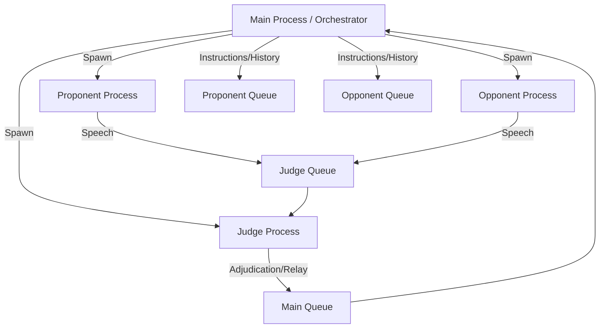

# 🏛️ AI-Agent Debate Platform: System Overview

This document provides a comprehensive summary of the autonomous, multi-agent AI debate platform, its architecture, agent personas, and operational instructions.

---

## 🏗️ 1. System Architecture

The platform is built on a deterministic Python orchestration layer that manages isolated agent processes. It follows a **Judge-Relay** model to ensure strict "No Direct Communication" between debaters.

### 🔄 Debate Flow & IPC
The system utilizes a 20-turn formal **Durham Union** debate layout. Communication occurs via thread-safe `multiprocessing.Queue` objects.



### 🛡️ Safety & Reliability Guardrails
- **Process Watchdog**: A background thread monitors each turn. If a process hangs (e.g., API timeout), it is forcefully terminated via `os.kill(pid, signal.SIGKILL)`.
- **FIFO Log Rotation**: Telemetry is stored in rotating files capped at 500 lines (~45KB) to protect disk space.
- **Recovery Checkpoints**: A brief `agent_checkpoint.md` is maintained after every turn, allowing replacement processes to re-orient instantly after a crash.

---

## 👥 2. Agent Personas & Skills

### 🔵 Proponent Agent
- **Persona**: An articulate advocate arguing **IN FAVOR** of the motion. 
- **Skills**:
    - **PEEL Structure**: Point, Explanation, Evidence, Link-back.
    - **Grounding**: Invokes DuckDuckGo search for real-world citations.
    - **Rhetoric**: Uses persuasive academic language.
- **Role**: Starts the debate and maintains the constructive vision.

### 🔴 Opponent Agent
- **Persona**: A critical thinker arguing **AGAINST** the motion.
- **Skills**:
    - **Refutation**: Specializes in identifying logical fallacies in the Proponent's case.
    - **Grounding**: Uses search to find counter-evidence and data.
    - **Critical Analysis**: Focuses on unintended consequences and moral/practical risks.
- **Role**: Rebuts the Proponent and provides the counter-narrative.

### ⚖️ Judge Agent (The Adjudicator)
- **Persona**: An elite, impartial academic adjudicator.
- **Skills**:
    - **Moderation**: Relays arguments and ensures the debate remains focused.
    - **Round Adjudication**: Evaluates each exchange for logic and evidence.
    - **Bi-Level Scoring**: Tracks round-by-round points and cumulative "Quality Scores".
    - **Tie-Breaking**: Implements a "No-Tie" mandate, using quality scores to resolve deadlocks.
- **Role**: The single source of truth for the verdict.

---

## 📜 3. Debate Structure (The 20-Turn Flow)

The debate follows three rigorous phases:
1. **Constructive Speeches (Turns 1-4)**: Building the core cases.
2. **Rebuttals & Extensions (Turns 5-16)**: Deepening logic and attacking opposing assumptions.
3. **Summary & Final Clashes (Turns 17-20)**: Crystallizing the debate into key winning points.

---

## 🛠️ 4. How to Run the Project

### Prerequisites
- Python 3.11+
- `uv` (Fast Python package manager)
- API Keys for Anthropic or Gemini (set in `.env`)

### Setup
1. **Sync Dependencies**:
   ```bash
   uv sync
   ```
2. **Configure Secrets**:
   Create a `.env` file in the root directory:
   ```env
   ACTIVE_API_KEY=your_key_here
   ```
3. **Set Provider**:
   Open `config/setup.json` and set `"use_provider"` to `"anthropic"` or `"gemini"`.

### Execution
Launch the interactive Terminal UI:
```bash
uv run main.py
```

### Outputs
- **Live Transcript**: `logs/debate_summary.md`
- **Agent Recovery Checkpoint**: `logs/agent_checkpoint.md`
- **Historical Analytics**: `outputs/analytics/win_loss_matrix.json`
- **System Telemetry**: `logs/system_telemetry.log` (Rotated FIFO)

---

## 🧪 5. Testing
Run the unit test suite to verify core services:
```bash
PYTHONPATH=src uv run pytest tests/unit/
```
