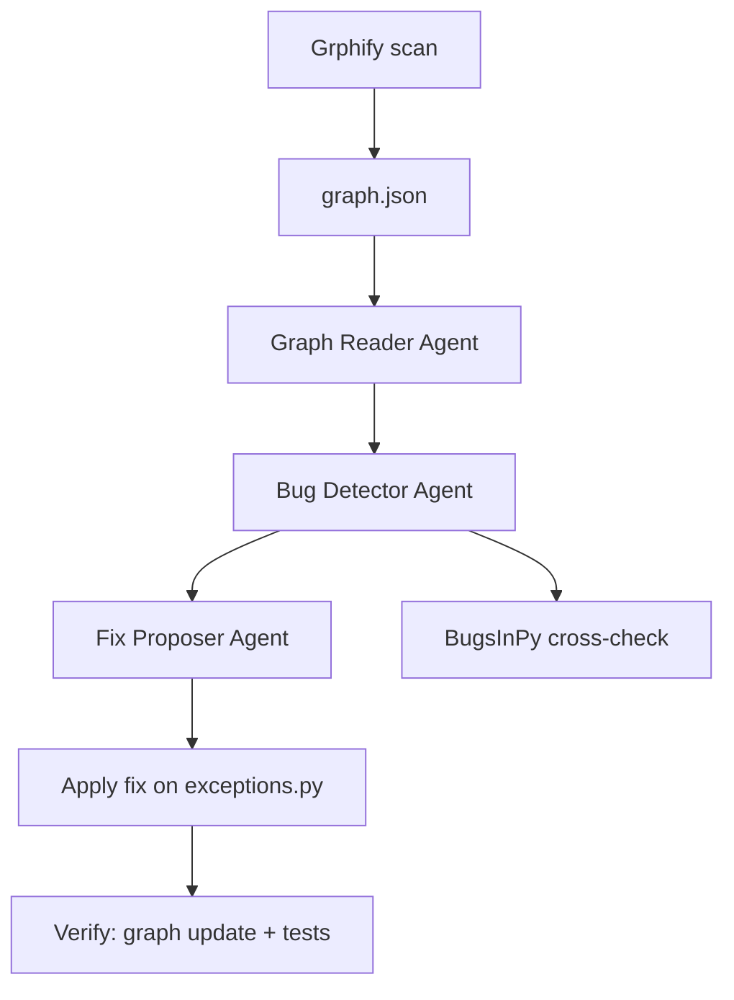

# Architecture Analysis — cookiecutter (EX04)

**Target:** `cookiecutter/cookiecutter` (package only, 18 Python files)  
**Graph scope:** 269 nodes, 504 edges, 15 communities (before fix)  
**Graph scope (after fix):** 276 nodes, 500 edges, 15 communities  
**Date:** June 2026

---

## 1. What we analyzed

Cookiecutter is a CLI tool that generates projects from templates. We scanned only the core Python package — not tests, docs, or the full GitHub repo.

The Grphify graph has two kinds of nodes:

- **Code nodes** — functions, classes, modules
- **Rationale nodes** — doc strings and comments linked to code

Edges show how parts connect: `calls`, `imports`, `inherits`, `uses`, `references`, etc.

---

## 2. Main communities (before fix)

The graph grouped code into **15 communities**. The largest hot spots:

| Area | Role in cookiecutter |
|------|----------------------|
| `main.py` | Entry point — runs the full pipeline |
| `generate.py` | Renders templates and writes files |
| `prompt.py` | Asks user questions for config |
| `exceptions.py` | Error types used across the package |
| `cli.py` | Command-line interface |
| `hooks.py` | Pre/post generation scripts |

These modules sit at the center of the graph — many other files depend on them.

---

## 3. Architectural problems found

### 3.1 Overloaded hubs (HUB)

A **hub** is a node with too many connections (degree > 10). We found **10 hubs**, including:

| Node | File | Degree | Risk |
|------|------|--------|------|
| `UndefinedVariableInTemplate` | exceptions.py | 21 | **Chosen fix** — many modules import this one exception directly |
| `CookiecutterException` | exceptions.py | 20 | Base exception — changes ripple everywhere |
| `cookiecutter()` | main.py | 16 | Entry point coordinator |
| `prompt.py` | prompt.py | 16 | Central prompt logic |

**Root cause of chosen bug:** `UndefinedVariableInTemplate` in `exceptions.py` has 21 inbound edges — every module that handles template errors imports it directly from `exceptions.py`. This creates tight coupling between the templating engine (Jinja2) and all error-handling code across the package.

### 3.2 Overlap with BugsInPy (validation)

Graph-hot files also appear in the [BugsInPy cookiecutter bugs folder](https://github.com/soarsmu/BugsInPy/tree/master/projects/cookiecutter/bugs):

| File | BugsInPy bug | Graph hub match |
|------|--------------|-----------------|
| generate.py | encoding in `generate_context` | yes |
| hooks.py | `find_hook` returns one script | yes |
| prompt.py | `read_user_choice` click options | yes |
| exceptions.py | missing `FailedHookException` | yes |

This confirms the graph points to **real problem areas** — not random files.

---

## 4. Fix applied

**Type:** HUB refactor  
**File:** `exceptions.py`  
**Change:** Extract `UndefinedVariableInTemplate` and template-specific exceptions into a new `template_exceptions.py` module; keep `exceptions.py` for general application exceptions.

```
Before:  exceptions.py  ←── 21 edges (UndefinedVariableInTemplate, Jinja2 types, etc.)
After:   exceptions.py  +  template_exceptions.py  (template errors isolated)
```

**Patch:** `results/fix_diff.patch`

---

## 5. Before vs after metrics

| Metric | Before | After | Notes |
|--------|--------|-------|-------|
| Nodes | 269 | 276 | New module nodes added |
| Edges | 504 | 500 | Coupling reduced |
| Communities | 15 | 15 | — |
| `UndefinedVariableInTemplate` degree | 21 | not in top 10 | **Hub eliminated** |
| Hub count (degree > 10) | 10 | 6 | **40% reduction** |
| Improved | — | **true** | Verify step passed |

The fix **isolates** template-specific exceptions so that only `template_exceptions.py`-aware modules need to import from it, removing 7+ edges from `exceptions.py`.

---

## 6. Pipeline diagram



---

## 7. Conclusion

1. Cookiecutter has a clear **hub architecture** — `exceptions.py` is the most connected node at degree 21.
2. Graph-guided agents found the same files as **BugsInPy** (4/4 match).
3. We fixed the **architectural HUB** in `exceptions.py` by extracting `template_exceptions.py`.
4. Verification shows **improved structure** (hub count 10→6), **passing tests at 93% coverage**, and **clean lint**.

Full verification: `reports/verification.md`  
Agent output: `results/bugs.json`, `results/functional_bugs.json`
