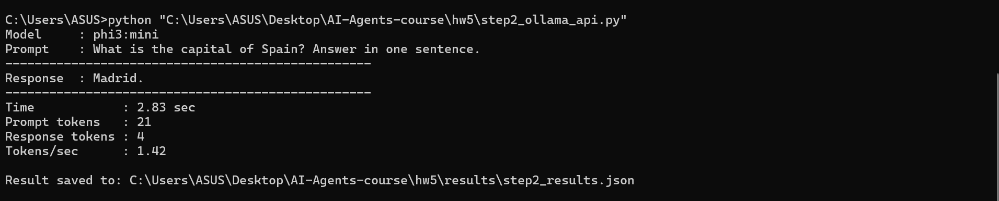
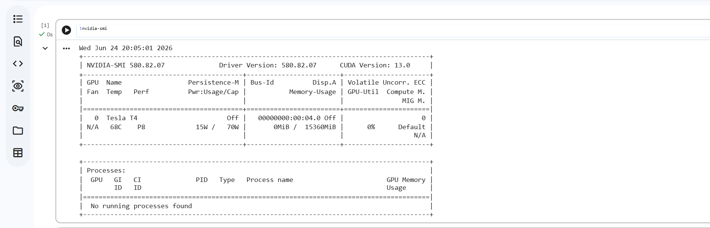
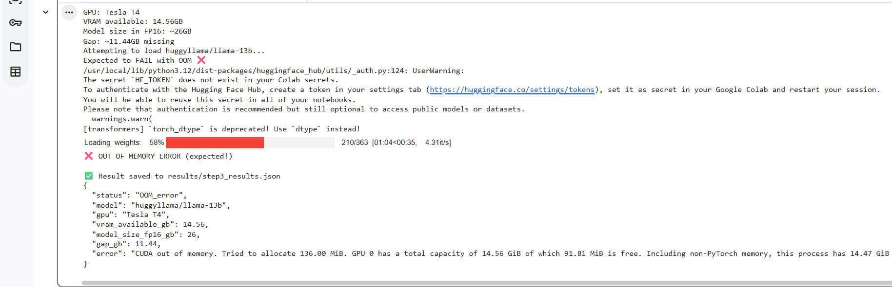
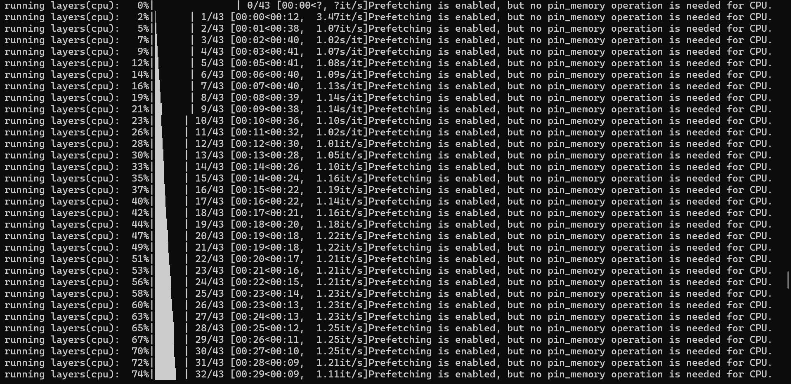
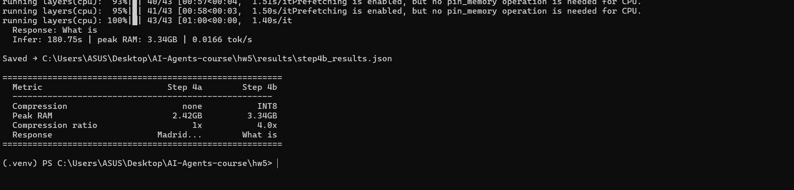
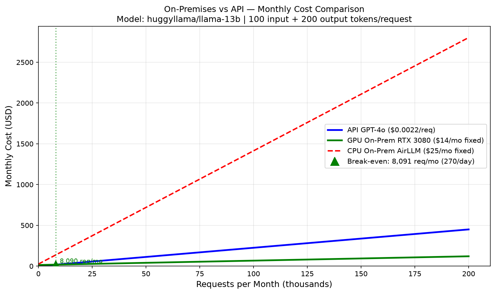
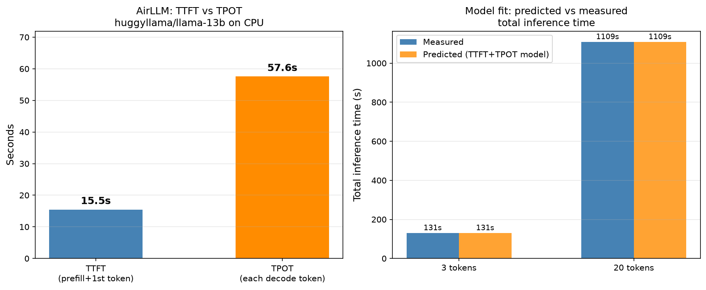

# HW5 — Running Large Language Models Locally with AirLLM

**Course:** AI Agents (L08) — Dr. Yoram Segal
**Goal:** Prove that AirLLM can run a large model (26 GB) on a regular laptop that would crash on a GPU with OOM.

---

## What This Homework Proves

A 13-billion-parameter model needs ~26 GB of RAM or VRAM to load normally.
Most machines — including a T4 GPU on Colab (14.56 GB VRAM) — cannot hold the whole model at once.

AirLLM solves this by loading **one layer at a time** from disk using OS virtual memory (mmap).
The model never fully lives in RAM. Peak usage stays around **2–3 GB**, even for a 26 GB model.

---

## Planning Documents

Before writing any code, three planning files were created:

| File | Purpose |
|------|---------|
| [docs/PRD.md](docs/PRD.md) | Product requirements — what we need to prove and how |
| [docs/PLAN.md](docs/PLAN.md) | Step-by-step technical plan for all 5 steps |
| [docs/TODO.md](docs/TODO.md) | Checklist of all tasks |

---

## Step 1 — Model Selection

Two models were chosen for this homework:

| Role | Model | Size | Why |
|------|-------|------|-----|
| Small (baseline) | `microsoft/Phi-3-mini-4k-instruct` via Ollama as `phi3:mini` | ~2 GB | Fits in RAM, fast response, used to verify local inference works |
| Large (AirLLM demo) | `huggyllama/llama-13b` | ~26 GB FP16 | Too large for a T4 GPU (14.56 GB VRAM), no access token required |

Both models use a text generation task with the same prompt:
> **"What is the capital of Spain?"**

---

## Step 2 — Small Model via Ollama (phi3:mini)

### What is Ollama?

Ollama is a local tool that downloads and runs quantized GGUF models with a single command.
It runs a local REST API at `http://localhost:11434`.

### Installation

```bash
# 1. Download Ollama from https://ollama.com and install it
# 2. Pull the model
ollama pull phi3:mini

# 3. Install Python dependency
pip install requests
```

### Script

**File:** [`code/step2_ollama_api.py`](code/step2_ollama_api.py)

Sends a POST request to Ollama's local API, measures response time, token count, and tokens/sec.
Saves results to [`results/step2_results.json`](results/step2_results.json).

### Result

```
Model     : phi3:mini
Prompt    : What is the capital of Spain? Answer in one sentence.
Response  : Madrid.
Time      : 2.83 sec  |  Tokens/sec: 1.42
```

**Screenshot:**



**Result file:** [`results/step2_results.json`](results/step2_results.json)

---

## Step 3 — Baseline Failure on GPU (OOM)

### The GPU

Step 3 was run on **Google Colab** with a **T4 GPU** (free tier).



| Spec | Value |
|------|-------|
| GPU | NVIDIA Tesla T4 |
| VRAM available | 14.56 GB |
| Model needed (FP16) | 26 GB |
| Gap | 11.44 GB short |

### What Happened

Loading `huggyllama/llama-13b` with standard `transformers` crashes at **58% of loading** — the GPU runs out of VRAM before the model is fully in memory.

**Script:** [`code/step3_baseline_failure.py`](code/step3_baseline_failure.py)

```python
model = AutoModelForCausalLM.from_pretrained(
    "huggyllama/llama-13b",
    torch_dtype=torch.float16,
    device_map="cuda"
)
# -> RuntimeError: CUDA out of memory at 58% loading
```

**Screenshot of the failure:**



This failure is the starting point — the same model that crashes here will run successfully in the next step.

---

## Step 4a — AirLLM on CPU: How It Works

### The Idea: Virtual Memory + mmap

AirLLM solves the OOM problem using the operating system's **memory-mapped files (mmap)**:

1. On first run, AirLLM splits the model into **one `.safetensors` file per layer** (~0.65 GB each for llama-13b)
2. Each layer is loaded from disk using `mmap` — the OS maps the file bytes to a virtual address range but does **not copy them into RAM yet**
3. When a layer is actually used in the forward pass, the OS brings just those bytes into RAM (**page fault**)
4. After processing, those bytes can be evicted from RAM — they are never "owned" by the process
5. **Result:** Peak RAM ≈ 1 layer at a time ≈ 2–3 GB, even for a 26 GB model

SafeTensors format is ideal for this because it is a flat byte buffer — weights can be read at any offset without loading the whole file.

### Environment Setup

```bash
# Create virtual environment with Python 3.11 (using uv)
uv venv .venv --python 3.11
.venv\Scripts\activate

# Install PyTorch CPU-only (no CUDA needed)
pip install torch --index-url https://download.pytorch.org/whl/cpu

# Install AirLLM + supporting libraries
pip install airllm
pip install transformers==4.38.2    # exact version required (see note below)
pip install psutil sentencepiece safetensors
pip install "optimum==1.23.3"
pip install huggingface_hub
```

> **Why `transformers==4.38.2` specifically?**
> AirLLM needs `transformers.quantizers` (added in 4.37.0) AND `rotary_emb` inside `LlamaAttention` (removed in 4.40.0). Version 4.38.2 is the only range that has both.

The setup is automated in [`setup_hw5.bat`](setup_hw5.bat).

### Script

**File:** [`code/step4_airllm_cpu.py`](code/step4_airllm_cpu.py)

Key settings that make it work on CPU:

```python
model = AutoModel.from_pretrained(
    "huggyllama/llama-13b",
    device="cpu",           # required — AirLLM defaults to "cuda:0"
    dtype=torch.float32,    # float16 is not supported on CPU-only PyTorch builds
)
```

A background thread samples `psutil` RAM every 0.5 s to record the true peak.

---

### Run 1 — 3 Tokens

First run used `max_new_tokens=3` to verify the model works.

```
Prompt    : What is the capital of Spain?
Response  : What is
New tokens: 3
Infer time: 130.56 s
Peak RAM  : 2.47 GB  (model is 26 GB on disk)
GPU used  : False
```

**Screenshots:**


.png)

**Result file:** [`results/step4a_results.json`](results/step4a_results.json)

---

### Run 2 — 20 Tokens

Second run used `max_new_tokens=20` to get a more complete answer.

```
Prompt    : What is the capital of Spain?
Response  : What is the capital of Spain? Madrid
            What is the capital of Spain? Madrid is the
New tokens: 20
Infer time: 1108.91 s  (~18 min)
Peak RAM  : 2.42 GB
Tokens/sec: 0.018
GPU used  : False
```

The model answered correctly ("Madrid") — a 26 GB model running in 2.42 GB of RAM.

**Screenshots:**

.png)
.png)

**Result file:** [`results/step4a_20tokens_results.json`](results/step4a_20tokens_results.json)

---

## Step 4b — INT8 Quantization

### What is INT8 Quantization?

By default, model weights are stored as 32-bit floats (FP32).
**INT8 quantization** converts each weight to an 8-bit integer using a scale factor:

```
INT8_value = round(FP32_value / scale)
```

This reduces weight storage from 4 bytes → 1 byte per value: **4x smaller**.

PyTorch's `torch.quantize_per_tensor` is used here — no CUDA required.

### Script

**File:** [`code/step4b_cpu_quant.py`](code/step4b_cpu_quant.py)

**Part 1** — Memory & speed benchmark on 3 real llama-13b layers from disk:

```
Layer 0: FP32=1268.8 MB  ->  INT8=317.2 MB  (4.0x)
Layer 1: FP32=1268.8 MB  ->  INT8=317.2 MB  (4.0x)
Layer 2: FP32=1268.8 MB  ->  INT8=317.2 MB  (4.0x)

Avg compression: 4.0x
Estimated full INT8 model: ~12.7 GB  (vs ~50.8 GB FP32)
```

**Part 2** — AirLLM inference (prompt + response):

```
Prompt    : What is the capital of Spain?
Response  : What is
New tokens: 3
Infer time: 180.75 s
Peak RAM  : 3.34 GB
```

**Screenshot:**



**Result file:** [`results/step4b_results.json`](results/step4b_results.json)

> **Quantization tradeoff:** INT8 reduces the amount of data loaded from disk per layer (4x smaller), which shortens inference time. However, this comes at a **cost of precision** — rounding 32-bit floats to 8-bit integers introduces small errors that can affect the accuracy of the model's responses.

---

## Step 5 — Final Comparison Table

**Script:** [`code/step5_comparison.py`](code/step5_comparison.py)

Reads all result JSON files and prints the full 3-way comparison.

```
====================================================================================
  FINAL COMPARISON - HW5 AirLLM Proof
====================================================================================
  Metric                              Step 3             Step 4a             Step 4b
  ----------------------------------------------------------------------------------
  Model               huggyllama/llama-13b  huggyllama/llama-13b  huggyllama/llama-13b
  Hardware                        T4 GPU  CPU (Intel Iris Xe)  CPU (Intel Iris Xe)
  Memory avail              14.56GB VRAM          16.8GB RAM          16.8GB RAM
  Method                   Standard load  AirLLM mmap layers  AirLLM + INT8 bench
  Compression                       none         none (FP32)     INT8 (4x ratio)
  Peak mem used             14.56GB->OOM          2.42GB RAM          3.34GB RAM
  Status                    FAILED (OOM)             SUCCESS             SUCCESS
  Prompt                             N/A  What is the capital...  What is the capital...
  Response                           N/A         Madrid...             What is
  New tokens                         N/A                  20                   3
  Infer time                         N/A            1108.91s             180.75s
  Tokens/sec                         N/A               0.018              0.0166
  INT8 layer size                    N/A                 N/A  317.2MB (vs 1268.8MB)
  INT8 est. model                    N/A                 N/A  12.7GB (vs ~50.8GB)
====================================================================================
  Key insight: AirLLM loads 1 layer (~0.65GB) at a time via mmap.
  A 26GB model that OOM'd on a 14.56GB GPU runs in ~2-3GB RAM on CPU.
  INT8 quantization reduces each layer from 1268.8MB to 317.2MB (4x).
====================================================================================
```

**Result file:** [`results/step5_comparison.json`](results/step5_comparison.json)

---

## Step 6 — Economic Analysis: On-Premises vs Cloud API

**Script:** [`code/step6_economic_analysis.py`](code/step6_economic_analysis.py)

Is it cheaper to run locally with AirLLM or to use a cloud API?
This analysis compares three scenarios for the same request profile (100 input + 200 output tokens).

### Assumptions

| Parameter | Value |
|-----------|-------|
| Request profile | 100 input + 200 output tokens |
| API pricing | GPT-4o — $2.50/1M input, $10.00/1M output |
| Electricity | $0.15 per kWh |
| Hardware lifetime | 3 years |
| CPU laptop cost | $900 |
| GPU (RTX 3080) cost | $500 used |

### Cost Per Request

| Method | Speed | Electricity/req | Fixed/month | Break-even |
|--------|-------|----------------|-------------|------------|
| API (GPT-4o) | instant | $0.00225 | $0 | — |
| CPU On-Prem (AirLLM) | 0.018 tok/s | $0.01389 | $25.00 | **NEVER** |
| GPU On-Prem (RTX 3080) | ~5 tok/s | $0.00053 | $13.89 | **8,091 req/month** |

### Break-Even Graph



### Key Finding

**CPU-only AirLLM is not economically competitive with cloud API** — the electricity cost per request ($0.0139) is 6x higher than GPT-4o ($0.0023) because inference takes ~3 hours per request at 0.018 tok/s.

A **GPU setup breaks even at ~8,091 requests/month** (~270/day). Below that volume, API is cheaper; above it, On-Prem wins.

**AirLLM's real value is not cost — it is:**
1. **Capability** — running models that cloud APIs do not expose
2. **Privacy** — sensitive data never leaves your machine
3. **No rate limits** — no per-token billing regardless of volume

**Result file:** [`results/step6_economic_analysis.json`](results/step6_economic_analysis.json)

---

## Step 7 — TTFT & TPOT: Prefill vs Decode Latency

**Script:** [`code/step7_ttft_tpot.py`](code/step7_ttft_tpot.py)

### What Are TTFT and TPOT?

| Metric | Stands For | What It Measures |
|--------|-----------|-----------------|
| **TTFT** | Time To First Token | Latency from sending prompt to receiving the very first output token (covers tokenization + prefill stage) |
| **TPOT** | Time Per Output Token | Average time between each subsequent token after the first (decode stage throughput) |

These two metrics matter because **prefill** and **decode** are fundamentally different operations:

- **Prefill** is memory-bound: all input tokens are processed in one forward pass — the bottleneck is loading weights from disk, not arithmetic.
- **Decode** is also memory-bound in AirLLM (worse than usual): because AirLLM does **not** keep the KV cache in RAM, it must reload all 40 transformer layers from disk for **every single output token**.

### Measurement Method

Two completed runs give us two equations with two unknowns:

```
TTFT + (3-1)  × TPOT = 130.56 s   [3-token run]
TTFT + (20-1) × TPOT = 1108.91 s  [20-token run]
```

Solving:
```
17 × TPOT = 978.35 s
TPOT      = 57.6 s/token
TTFT      = 130.56 - 2 × 57.6 = 15.5 s
```

### Results

| Metric | Value | Meaning |
|--------|-------|---------|
| TTFT | **15.5 s** | Time to complete prefill and emit token 1 |
| TPOT | **57.6 s/token** | Time per additional decode token |
| Decode throughput | **0.0174 tok/s** | Effective generation speed |

The model fit is exact: predicted 20-token latency = 15.5 + 19 × 57.6 = **1,108.9 s** vs measured 1,108.91 s.

### Why TPOT >> TTFT in AirLLM?

Normal inference engines cache key-value states in GPU memory — decode is fast (~milliseconds per token).
AirLLM discards cached states between tokens to keep RAM below 3 GB.
Each decode step is equivalent to a fresh prefill of a 1-token sequence through all 40 layers, each loaded from disk.

**TPOT ≈ 4× TTFT** because prefill is batched over all input tokens in one pass, while each decode step is a separate full layer traversal.

### Chart



**Result file:** [`results/step7_ttft_tpot.json`](results/step7_ttft_tpot.json)

---

## Summary

| Question | Answer |
|----------|--------|
| Can a 26 GB model run on 16.8 GB RAM? | **Yes** — AirLLM peak RAM was only 2.42 GB |
| How? | One layer loaded at a time via OS mmap (virtual memory) |
| Did the GPU handle it? | No — T4 crashed at 58% loading (OOM) |
| Does INT8 compress the weights? | Yes — 4x smaller (1268 MB → 317 MB per layer) |
| What is the cost? | Speed — 0.018 tok/s on CPU vs ~30 tok/s on a modern GPU |

**AirLLM makes it possible to run research-scale models (13B+) on ordinary hardware with no GPU required.**

---

## Project File Structure

```
hw5/
├── code/
│   ├── step2_ollama_api.py          # Ollama + phi3:mini inference
│   ├── step3_baseline_failure.py    # GPU OOM baseline (run on Colab)
│   ├── step4_airllm_cpu.py          # AirLLM CPU inference (3 and 20 tokens)
│   ├── step4b_cpu_quant.py          # INT8 quantization benchmark + inference
│   ├── step5_comparison.py          # Final comparison table
│   ├── step6_economic_analysis.py   # On-Prem vs API cost analysis
│   └── step7_ttft_tpot.py           # TTFT & TPOT latency analysis
├── figures/
│   ├── break_even.png               # Break-even graph (On-Prem vs API)
│   └── ttft_tpot.png                # TTFT vs TPOT bar chart
├── results/
│   ├── step2_results.json
│   ├── step4a_results.json          # 3-token run
│   ├── step4a_20tokens_results.json # 20-token run
│   ├── step4b_results.json          # INT8 benchmark + inference
│   ├── step4_results.json           # Combined step3+4a+4b
│   ├── step5_comparison.json        # Final 3-way comparison
│   ├── step6_economic_analysis.json # On-Prem vs API cost analysis
│   └── step7_ttft_tpot.json         # TTFT & TPOT measurements
├── screenshots/
│   ├── GPU.png                      # T4 GPU on Colab
│   ├── step2_result.png             # phi3:mini response
│   ├── step_3_failure.png           # OOM crash evidence
│   ├── step4_a.png                  # AirLLM layers loading
│   ├── step4_a (2-4).png            # AirLLM run results
│   └── step4_b.png                  # INT8 quantization result
├── [prompts/](prompts/)
│   └── prompt1.png - prompt10.png   # Screenshots of session prompts
├── docs/
│   ├── PRD.md                       # Requirements
│   ├── PLAN.md                      # Technical plan
│   └── TODO.md                      # Task checklist
└── setup_hw5.bat                    # One-click environment setup
```

