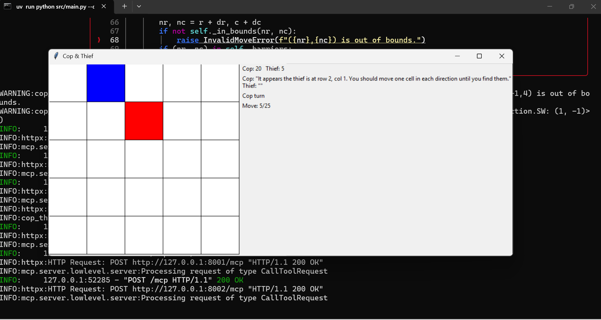
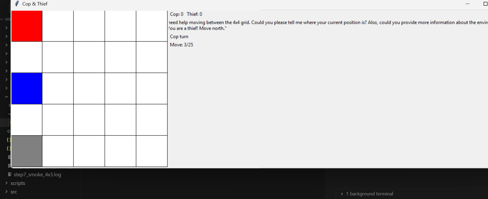
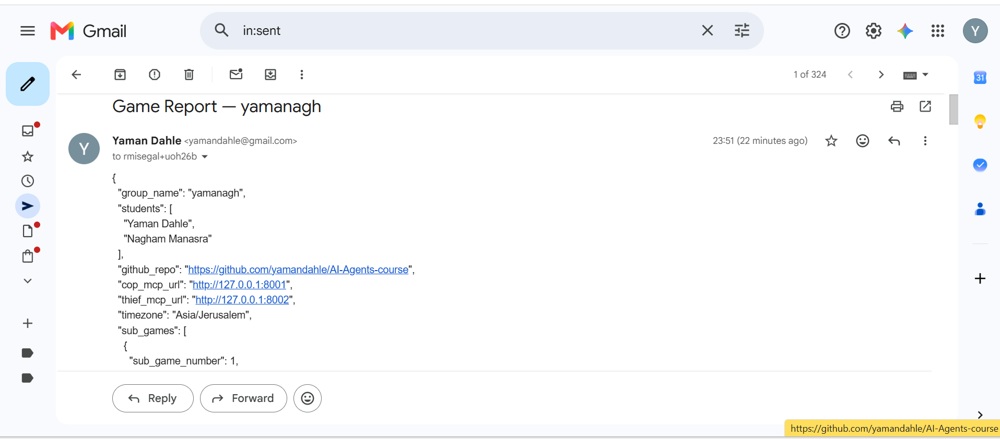
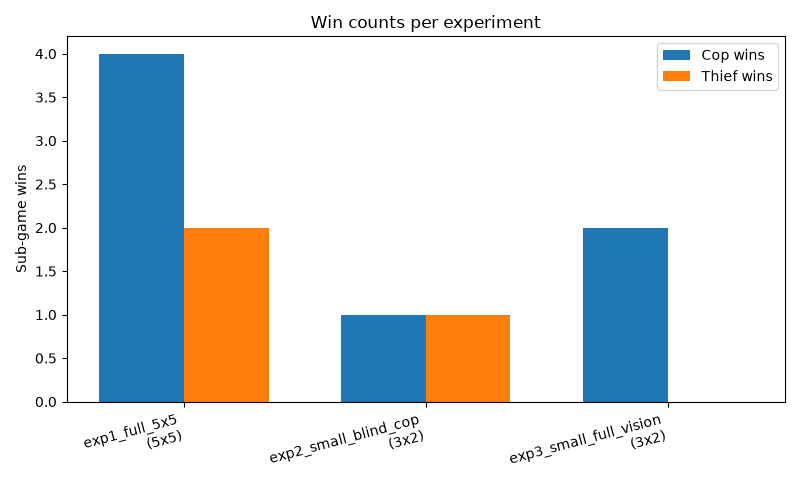
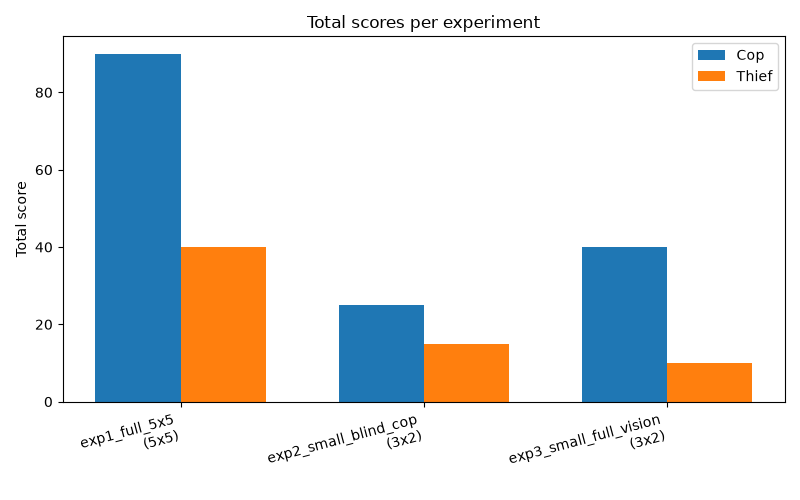
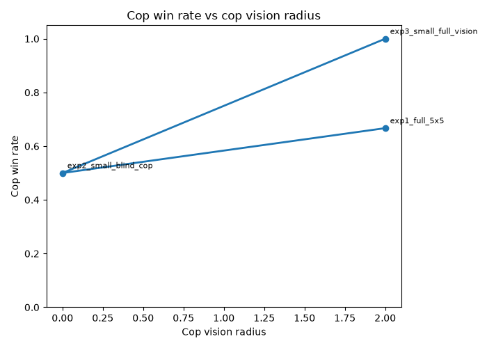
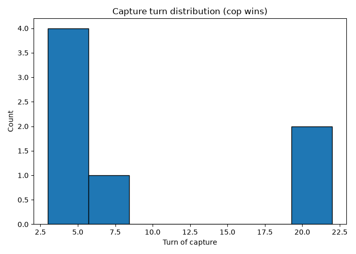

# Cop & Thief — EX06: Dual AI Agents via MCP

**Yaman Dahle** · **Nagham Manasra**  
Group: **yamanagh**  
Repository: [github.com/yamandahle/AI-Agents-course](https://github.com/yamandahle/AI-Agents-course)

---

## 1. Goal

Build an autonomous two-agent pursuit game where:

- A **Cop** agent chases a **Thief** agent on a configurable 2D grid.
- Each agent has its own **MCP server** (FastMCP); the **LLM lives in the orchestrator client**, not inside the servers.
- Agents communicate **only in natural language** — never raw coordinates.
- Each agent has partial observability (**fog of war**) controlled by a per-agent **vision radius** in config.
- After a full official game, the Cop agent sends a **JSON-only Gmail report** to the lecturer.
- We run **experiments** changing vision radius and compare outcomes with saved logs and graphs.

---

## 2. Project stages

We built the project in seven phases (see `docs/PLAN.md` and `docs/TODO.md`):

| Phase | What we built | Status |
|-------|---------------|--------|
| **1 — Game engine** | Board, sub-game, fog-of-war observations, scoring (`sdk/game_engine/`) | Done |
| **2 — MCP servers** | Cop + Thief FastMCP servers on ports 8001 / 8002 | Done |
| **3 — Orchestrator + LLM** | Ollama integration, prompts, game loop, `src/main.py` | Done |
| **4 — Q-table advisor** | Optional tabular RL hint injected into cop prompt | Done (not used in final runs) |
| **5 — GUI** | tkinter live board + info panel (`--gui`) | Done |
| **6 — Gmail report** | OAuth, JSON report builder, auto-send after full game | Done |
| **7 — Experiments** | 3-case vision comparison, metrics, graphs, `summary.csv` | Done |

**Sanity-check progression** (assignment recommendation): small grids first (3×2 smoke tests), then the official **5×5 × 6 sub-games × 25 moves** run.

---

## 3. Project structure

```
hw6/
├── src/
│   ├── main.py                      # Entry point (--gui, --config)
│   └── cop_thief/
│       ├── sdk/game_engine/         # Core game rules (no LLM)
│       ├── mcp/                     # cop_server.py, thief_server.py
│       ├── orchestrator/            # LLM loop, MCP client, prompts
│       ├── gui/                     # tkinter board + screenshots helper
│       ├── gmail/                   # OAuth + JSON report sender
│       ├── experiments/             # cases, metrics, graphs, runner
│       └── api_gatekeeper.py        # Rate limits for Ollama + Gmail
├── config/
│   ├── config.json                  # Base configuration
│   └── experiments/               # Per-experiment configs (3 files)
├── results/                         # Logs, metrics, graphs (see §4)
├── tests/                           # pytest (215 tests, ≥85% coverage)
└── docs/                            # PRD, PLAN, TODO, PROMPTS
```

**Architecture:**

```
Orchestrator (LLM client) ──MCP HTTP──► Cop server  (127.0.0.1:8001)
       │                                  Thief server (127.0.0.1:8002)
       └── Game engine (SDK) ◄───────────────────────┘
```

All game parameters come from JSON config — no hardcoded grid size, moves, or vision radii.

### LLM used

| Setting | Value |
|---------|--------|
| **Provider** | Ollama (local) — **Approach 3** from the assignment (no cloud deploy required for EX06) |
| **Model (experiments & official run)** | `qwen2.5:0.5b` — set in `config/experiments/*.json` |
| **Model (base config)** | `phi3:mini` — in `config/config.json` (fallback if you run without `--config`) |
| **Endpoint** | `http://localhost:11434` |

Pull the model once:

```powershell
ollama pull qwen2.5:0.5b
```

The orchestrator sends prompts to Ollama each turn; MCP servers have **no LLM inside them** — they only expose game tools.

### Cloud deployment?

**Not required for this homework.** EX06 uses **Approach 3 (local/hybrid)**: Ollama + MCP servers on `localhost`. Your PRD marks full **cloud deployment** and **inter-group bonus competition** as optional / out of scope — those are typically for a **bonus or final project**, not this submission.

The only “cloud” step you needed was **Google Cloud Console** for **Gmail OAuth** (sending the JSON report), not hosting the game online.

---

## 4. Results & analysis

We ran **three experiments** to study how **cop vision radius** affects outcomes.
Only **exp1** sends Gmail; exp2 and exp3 are fast small-grid comparisons.

### 4.1 Summary table

| Experiment | Grid | Vision (cop / thief) | Cop wins | Thief wins | Cop score | Thief score | Full log |
|------------|------|----------------------|----------|------------|-----------|-------------|----------|
| **exp1** — baseline | 5×5 | 2 / 2 | 4 | 2 | 90 | 40 | [result.json](results/exp1_full_5x5/result.json) |
| **exp2** — blind cop | 3×2 | **0 / 2** | 1 | 1 | 25 | 15 | [result.json](results/exp2_small_blind_cop/result.json) |
| **exp3** — full vision | 3×2 | **2 / 2** | 2 | 0 | 40 | 10 | [result.json](results/exp3_small_full_vision/result.json) |

Aggregated metrics: [results/summary.csv](results/summary.csv)  
Per-case metrics: [exp1](results/exp1_full_5x5/metrics.json) · [exp2](results/exp2_small_blind_cop/metrics.json) · [exp3](results/exp3_small_full_vision/metrics.json)  
Gmail send log: [results/gmail_log.json](results/gmail_log.json)

---

### 4.2 Experiment 1 — Official 5×5 baseline (vision 2 / 2)

**Config:** [config/experiments/exp1_full_5x5.json](config/experiments/exp1_full_5x5.json)  
**Hypothesis:** Equal vision on the full grid gives balanced, realistic play.  
**Gmail:** JSON report sent to `rmisegal+uoh26b@gmail.com`.

#### Sub-game breakdown

| # | Winner | Moves | Cop pts | Thief pts | Barriers |
|---|--------|-------|---------|-----------|----------|
| 1 | Cop | 22 | 20 | 5 | 4 |
| 2 | Thief | 25 | 5 | 10 | 5 |
| 3 | Cop | 6 | 20 | 5 | 2 |
| 4 | Cop | 4 | 20 | 5 | 1 |
| 5 | Cop | 22 | 20 | 5 | 5 |
| 6 | Thief | 25 | 5 | 10 | 5 |

**Cop win rate:** 67% (4/6). Thief survived all 25 moves in sub-games 2 and 6.

#### Screenshots (exp1)







#### JSON log

Full turn-by-turn log (moves + messages): **[results/exp1_full_5x5/result.json](results/exp1_full_5x5/result.json)**

---

### 4.3 Experiment 2 — Small grid, blind cop (vision 0 / 2)

**Config:** [config/experiments/exp2_small_blind_cop.json](config/experiments/exp2_small_blind_cop.json)  
**Hypothesis:** When the cop cannot see the opponent, the thief should perform better.

**Result:** Cop win rate **50%** (1/2). Scores Cop 25 — Thief 15. Average capture turn when cop won: **5.0**.

#### JSON log

**[results/exp2_small_blind_cop/result.json](results/exp2_small_blind_cop/result.json)** · [metrics.json](results/exp2_small_blind_cop/metrics.json)

---

### 4.4 Experiment 3 — Small grid, full vision (vision 2 / 2)

**Config:** [config/experiments/exp3_small_full_vision.json](config/experiments/exp3_small_full_vision.json)  
**Hypothesis:** When both agents see well on a small board, the cop should capture faster than in exp2.

**Result:** Cop win rate **100%** (2/2). Scores Cop 40 — Thief 10. Average capture turn: **3.5** (vs 5.0 in exp2).

#### JSON log

**[results/exp3_small_full_vision/result.json](results/exp3_small_full_vision/result.json)** · [metrics.json](results/exp3_small_full_vision/metrics.json)

---

### 4.5 Comparison graphs

Generated with:

```powershell
uv run python -m cop_thief.experiments.runner --graphs-only
```

#### Sub-game win counts (all experiments)



#### Total scores



#### Cop win rate vs cop vision radius



#### Capture turn distribution (when cop wins)



Graph files: [results/graphs/](results/graphs/)

---

### 4.6 Analysis & conclusion

| Comparison | Observation |
|------------|-------------|
| **exp2 vs exp3** (same 3×2 grid, different cop vision) | Raising cop vision from **0 → 2** raised cop win rate from **50% → 100%** and lowered average capture turns (**5.0 → 3.5**). |
| **exp1** (5×5, vision 2/2) | Cop won **4/6** sub-games; thief escaped to 25 moves twice — both agents can win on the full grid. |
| **Vision effect** | Higher cop vision → more captures, higher cop score, faster games on small grid. |
| **LLM behaviour** | `qwen2.5:0.5b` produced valid moves via MCP; messages were sometimes noisy but the pipeline stayed autonomous. |

**Takeaway:** Vision radius is a decisive parameter. The exp2/exp3 pair on 3×2 isolates this effect in minutes; exp1 validates the full assignment pipeline (6 sub-games, Gmail, detailed logs).

---

## 5. How to run

### Prerequisites

1. Install [Ollama](https://ollama.com) and run `ollama serve` in a separate terminal.
2. Pull the model: `ollama pull qwen2.5:0.5b`
3. From the `hw6/` folder: `uv sync`
4. For Gmail (exp1 only): place `credentials.json` + `token.json` in `hw6/` (git-ignored).

### Official submission run (5×5 + GUI + email)

```powershell
cd hw6
uv run python src/main.py --config experiments/exp1_full_5x5.json --gui
```

Saves log to `results/exp1_full_5x5/result.json` and emails JSON report to the lecturer.

### Experiments

```powershell
# One case with GUI
uv run python -m cop_thief.experiments.runner --case exp2_small_blind_cop --gui

# All 3 cases sequentially
uv run python -m cop_thief.experiments.runner --all --gui

# Rebuild summary.csv + graphs (no re-run)
uv run python -m cop_thief.experiments.runner --graphs-only
```

### Headless (no window)

Add `--headless` to `src/main.py`, or omit `--gui` on the runner.

### Tests

```powershell
uv run pytest tests/ --cov
uv run ruff check .
```

215 tests passing · coverage ≥ 85% · 0 ruff violations.
